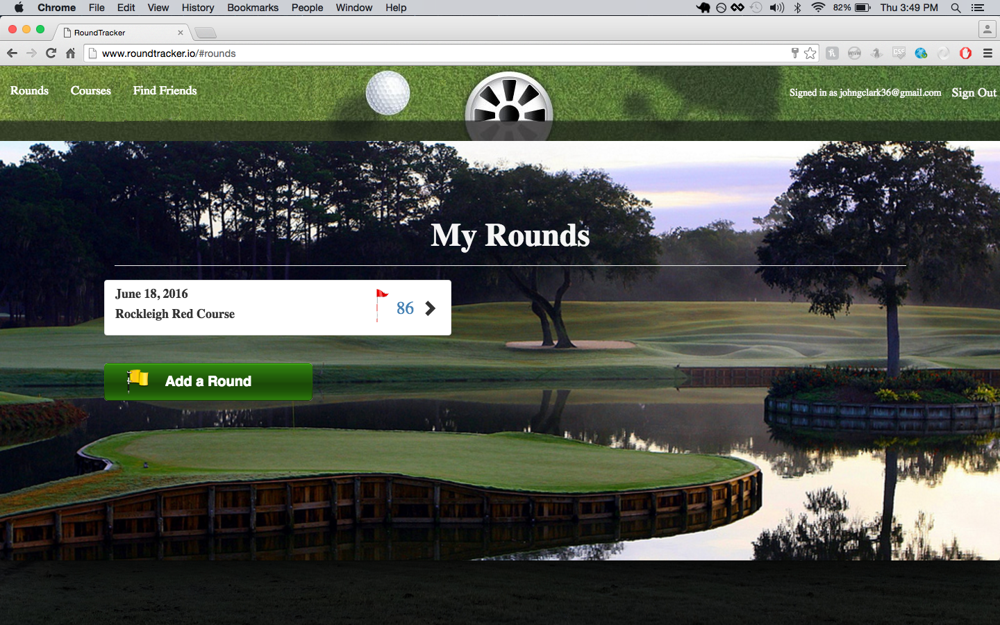
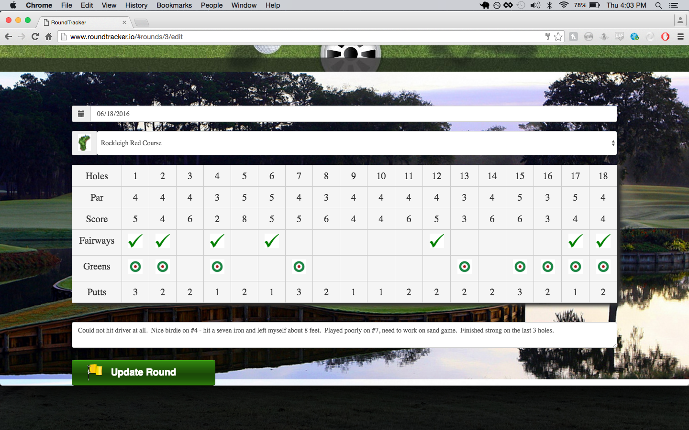
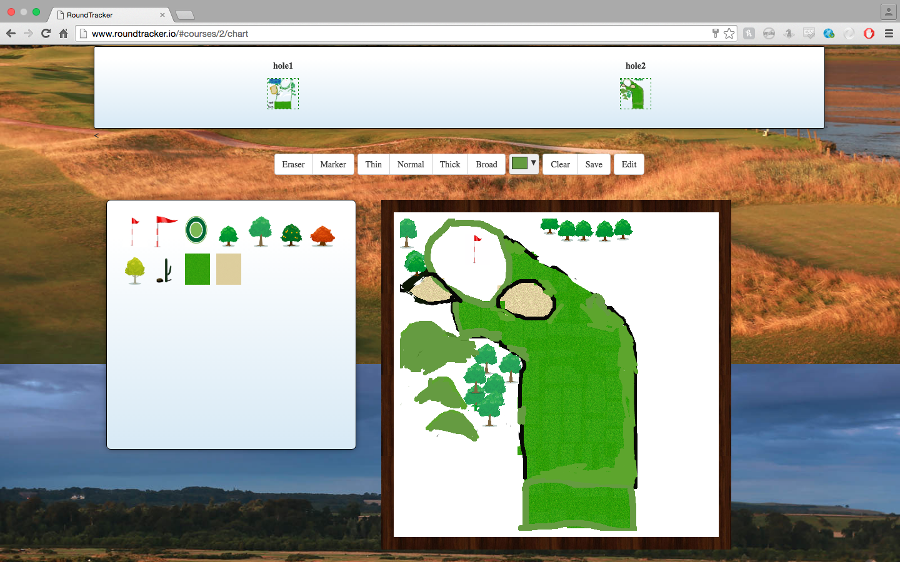

# Round Tracker

[live](roundtracker.io)

For my capstone project, I wanted to make something that I would actually use myself so I decided on a golf app which I could use to keep track of my rounds and the courses I've played.  I hope it can be used as a tool to help golfers see where they're dropping shots and improve their scores.

Round Tracker allows the user to create, read, update and delete their rounds and courses.  Users can find other users in the Users Search page and look at their friends' rounds and courses.  Another nice feature is the ability to chart out the holes for each of your courses.  These drawings can be viewed by other users as well.

To save hashes of round and course information, I used the PostgreSQL hstore data type.

# Tech

Rails, Backbone, PostgreSQL, jQuery, jQuery-ui, HTML5 Canvas

# Gems and Plugins

bcrypt-ruby, jbuilder, spectrum colorpicker, bootstrap-sass, jquery.serializejson

# Screenshots

